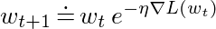

# Exponentiated-Gradient-PyTorch

Implementation of the exponentiated gradient (EG) algorithm with positive and negative weights in PyTorch. This optimizer can be used like any other to train PyTorch models, and performs comparably to gradient-descent based methods. The EG algorithm was introduced in [1].

In the nonnegative only weights case, the update rule for EG is given by:

### Paper

[1] Kivinen, J & Warmuth, M (1997). Additive versus exponentiated gradient updates for linear
prediction. Journal of Tnformation and Computation 132, 1-64. 
